# Correction projet INF5190-H24 | ABEA05619105, DESM31559704

### Autrices:

* Anne-Sophie Abel-Levesque - ABEA05619105
* Milene Desjardins - DESM31559704

### A1 10xp - M.D.

#### Comment tester :

###### Importation des données avec la base de données "Contravention" déjà crée.

1. Ouvrez le terminal dans le répertoire du projet.
2. Exécutez la commande suivante : `$ python3 download.py`

###### Création de la base de données "Contravention"

1. Lancez la création de la table en exécutant : `$ python3
   create_table_contravention.py`
2. Double-cliquer sur le nouveau fichier **contravention.db** afin de créer
   la connexion.

### A3 5xp - M.D.

#### Comment tester :

Pour tester si le BackgroundScheduler fonctionne sans attendre à minuit,
suivez ces étapes :

###### Gestion des nouvelles dates d'importation

1. Ouvrez la console de gestion de votre base de données et accédez à la
   table des Contraventions.
2. Inscrivez les commandes suivantes **sans les exécuter**, car il faut ajuster
   les dates d'importation :

`UPDATE Contravention SET date_importation = '2024-04-01 12:08:00:000' WHERE
id_poursuite = 6119;`

`UPDATE Contravention SET date_importation = '2024-04-01 12:08:00:000' WHERE
id_poursuite = 1523;`
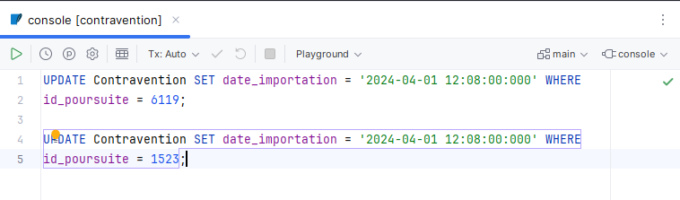

###### Mise à jour des dates :

3. Ajustez les dates d'importation en les
   configurant pour un **moment futur** (par exemple, **une minute après
   l'heure
   courante**).

4. Enregistrez les changements dans la base de données.

###### Mise à jour du CronTrigger :

5. Ouvrez le fichier 'main.py' et localisez la fonction 'start_scheduler()'.
   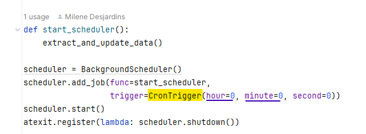
6. Ajustez l'**heure du CronTrigger** pour qu'elle soit réglée à **2 minutes
   après** l'heure d'importation des contraventions.
   Exemple:
   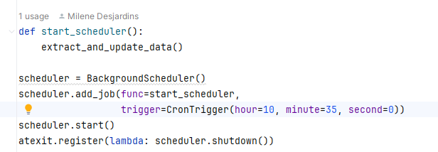
7. Pour démarrer l'application et appliquer les modifications, utilisez la
   commande suivante dans votre terminal : `$ make`

### B1 5xp - M.D.

#### Comment tester :

###### Utilisation MailDev

Installation de docker

1. Commencez par installer Docker sur votre ordinateur en suivant ce lien :
   https://www.docker.com/get-started/

###### Vérification de l'installation de Docker

2. Ouvrez un terminal et tapez la commande suivante pour vérifier si Docker
   est correctement installé : `docker --version`

###### Installation de MailDev

MailDev est un serveur SMTP de test qui intercepte tous les emails envoyés, les
affichant ensuite dans une interface web.

3. Pour installer MailDev, ouvrez votre terminal et exécutez les commandes
   suivantes :

   `$ docker pull maildev/maildev`

   `$ docker run -p 1080:1080 -p 1025:1025 maildev/maildev`
   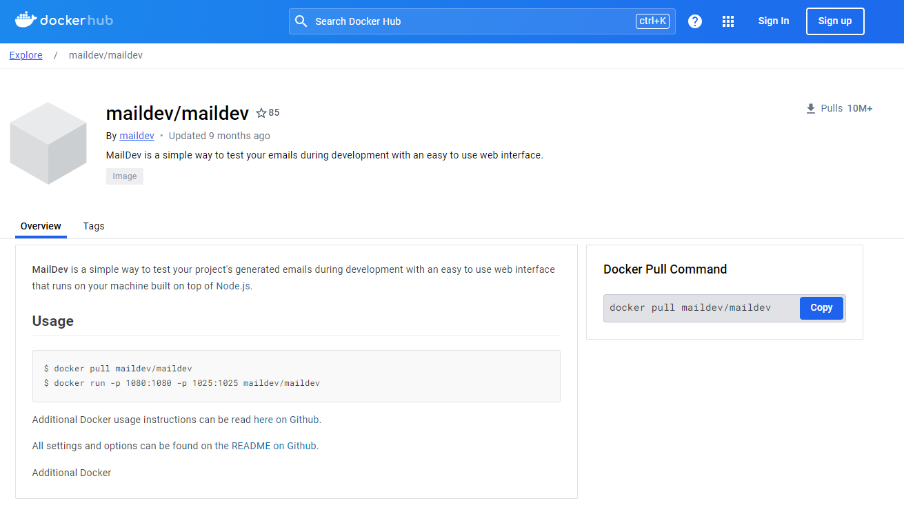
   Pour plus d'informations, veuillez lire la
   documentation : https://github.com/maildev/maildev/tree/master?tab=readme-ov-file

###### Démarrage de MailDev

6. Lancez Docker et démarrez le conteneur contenant l'image de MailDev.

###### Accéder à MailDev

7. Ouvrez un navigateur et allez sur : http://localhost:1080/ pour accéder à
   l'interface de MailDev.

##### Gestion des nouvelles dates d'importation

Pour tester le scénario d'envoi de notifications de nouvelles contraventions,
suivez ces étapes :

Il est nécessaire d'ajuster les dates d'importation de deux contraventions afin
de tester le scénario suivant : l'adresse email spécifiée sous "**monitoring**"
dans le fichier YAML doit recevoir une notification contenant les détails des
deux contraventions.

1. Ouvrez la console de gestion de votre base de données et accédez à la
   table des Contraventions.
2. Inscrivez les commandes suivantes **sans les exécuter**, car il faut ajuster
   les dates d'importation :

`UPDATE Contravention SET date_importation = '2024-04-01 12:08:00:000' WHERE
id_poursuite = 6119;`

`UPDATE Contravention SET date_importation = '2024-04-01 12:08:00:000' WHERE
id_poursuite = 1523;`


###### Mise à jour des dates :

3. Ajustez les dates d'importation en les
   configurant pour un **moment futur** (par exemple, **2 minutes après
   l'heure
   courante**).

4. Enregistrez les changements dans la base de données.

###### Mise à jour du CronTrigger :

5. Ouvrez le fichier 'main.py' et localisez la fonction 'start_scheduler()'.
   
6. Modifiez ensuite l'**heure du CronTrigger** pour qu'elle soit fixée après
   l'heure d'importation des deux contraventions. Dans ce cas précis,
   il faudrait la fixer à '_2024-04-01 12:10:00:000_', étant donné que
   l'heure d'importation est '_2024-04-01 12:08:00:000_'.

###### Lancement de l'application

5. Pour démarrer l'application et appliquer les modifications, utilisez la
   commande suivante dans votre terminal : `$ make`

6. Vérifiez les courriels reçus en accédant à l'onglet de navigation du **port
   1080 de MailDev** pour confirmer la
   réception des notifications.

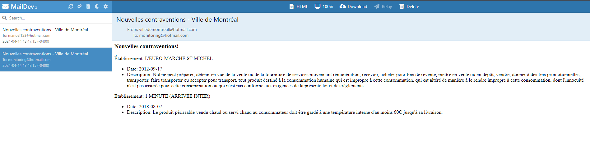

### C1 /api/etablissements 10xp - M.D.

#### Comment tester :

###### Documentation avec RAML

1. Lancez l'application avec la commande suivante dans votre terminal : `$
   make`
3. Ouvrez votre navigateur et accédez à http://127.0.0.1:5000/doc pour
   accéder à la documentation RAML.
4. Sélectionner la route '/api/etablissements'
   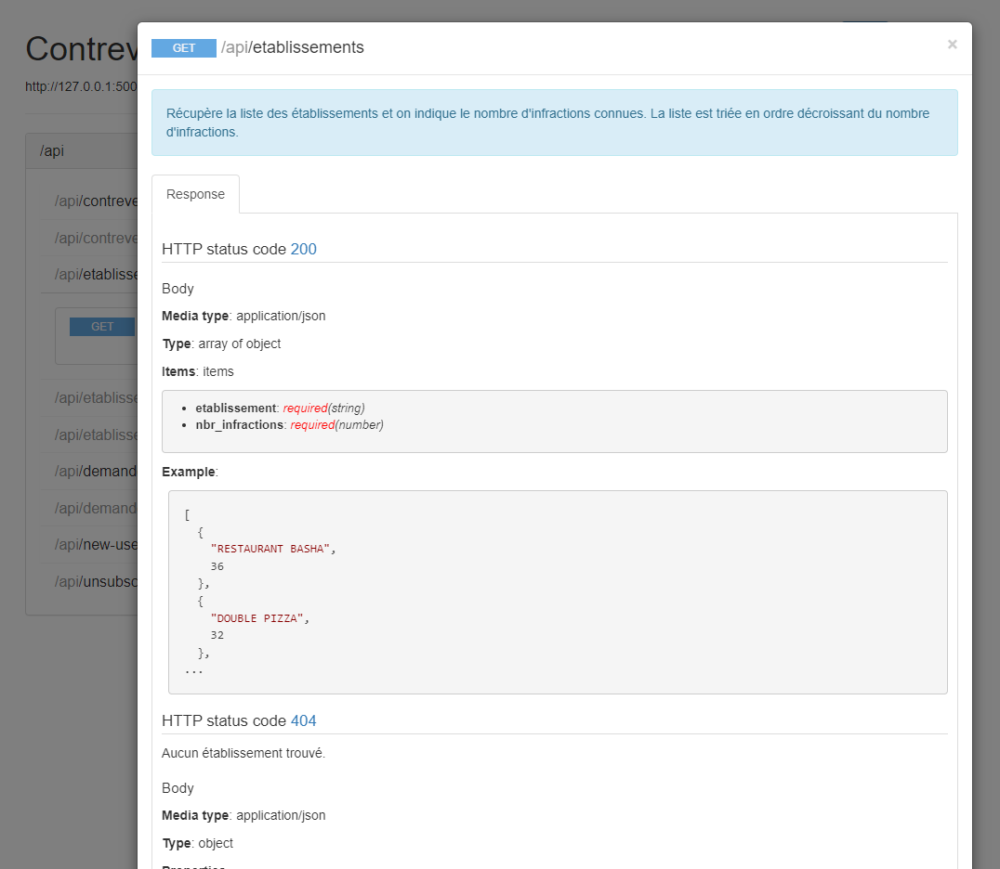

###### Installation YARC

1. Ouvrir Chrome : Lancez le navigateur **Google Chrome** sur votre ordinateur.

2. Accéder au Chrome Web Store : Allez sur le site du Chrome Web Store. Vous
   pouvez y accéder directement en tapant chrome web store dans la barre de
   recherche Google et en cliquant sur le premier résultat, ou en entrant l'URL
   suivante dans votre navigateur : Chrome Web Store.

3. Rechercher YARC : Dans la barre de recherche du Chrome Web Store, tapez
   **YARC** ou **Yet Another REST Client** et appuyez sur Entrée.

4. Installer YARC : Trouvez YARC dans les résultats de recherche et cliquez
   sur le bouton **Ajouter** à Chrome à côté de l'extension. Confirmez
   l'installation en cliquant sur Ajouter l'extension dans la fenêtre popup
   qui apparaît.

###### Utilisation de YARC

Après l'installation, vous pouvez commencer à utiliser YARC pour envoyer des
requêtes à une API :

1. **Lancer YARC** : Cliquez sur l'icône de YARC dans la barre d'outils de
   Chrome (
   en haut à droite, à côté de la barre d'adresse). Si l'icône n'apparaît pas
   directement, vous pourriez devoir cliquer sur l'icône du puzzle pour voir
   toutes les extensions et épingler YARC à la barre d'outils.
2. **Configurer la requête** :
    1. **URL** : Entrez l'URL de l'
       API 'http://127.0.0.1:5000/api/etablissements'
       dans le champ URL.
    2. **Méthode** : Sélectionnez la méthode HTTP 'GET' à partir du menu
       déroulant à côté de l'URL.
3. **Envoyer la requête** : Cliquez
   sur le bouton 'Send Request' pour l'envoyer. Les résultats de la requête
   apparaîtront
   dans la section Response en bas de l'interface de YARC.
   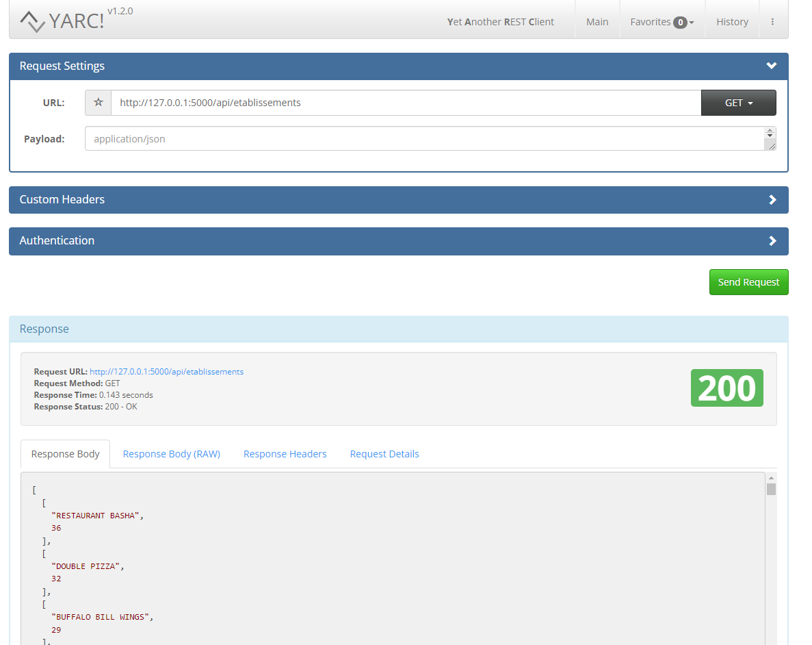

### C2 5xp /api/etablissements/xml - M.D.

#### Comment tester :

###### Documentation avec RAML

1. Lancez l'application avec la commande suivante dans votre terminal : `$
   make`
3. Ouvrez votre navigateur et accédez à http://127.0.0.1:5000/doc pour
   accéder à la documentation RAML.
4. Sélectionner la route '/api/etablissements/xml'
   

###### Utilisation de YARC

Après l'installation, vous pouvez commencer à utiliser YARC pour envoyer des
requêtes à une API :

1. **Lancer YARC** : Cliquez sur l'icône de YARC dans la barre d'outils de
   Chrome (
   en haut à droite, à côté de la barre d'adresse). Si l'icône n'apparaît pas
   directement, vous pourriez devoir cliquer sur l'icône du puzzle pour voir
   toutes les extensions et épingler YARC à la barre d'outils.
2. **Configurer la requête** :
    1. **URL** : Entrez l'URL de l'API
       'http://127.0.0.1:5000/api/etablissements/xml'
       dans le champ URL.
    2. **Méthode** : Sélectionnez la méthode HTTP 'GET' à partir du menu
       déroulant à côté de l'URL.
3. **Envoyer la requête** : Cliquez
   sur le bouton 'Send Request' pour l'envoyer. Les résultats de la requête
   apparaîtront
   dans la section Response en bas de l'interface de YARC.
   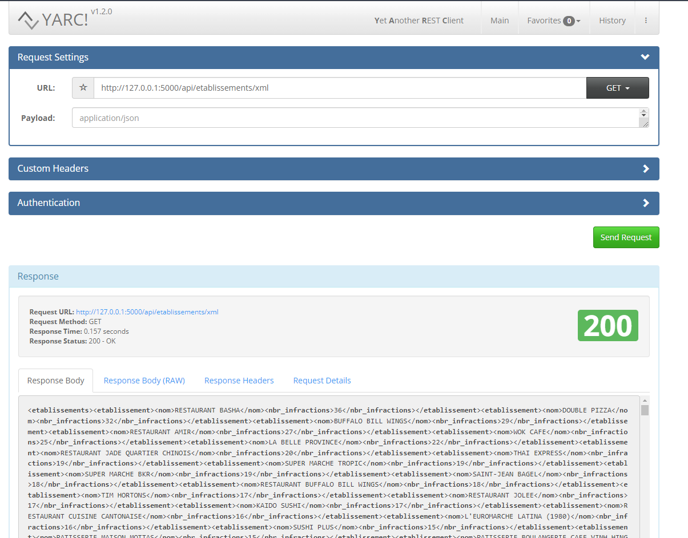

### C3 5xp /api/etablissements/csv - M.D.

#### Comment tester :

###### Documentation avec RAML

1. Lancez l'application avec la commande suivante dans votre terminal : `$
   make`
3. Ouvrez votre navigateur et accédez à http://127.0.0.1:5000/doc pour
   accéder à la documentation RAML.
4. Sélectionner la route '/api/etablissements/csv'
   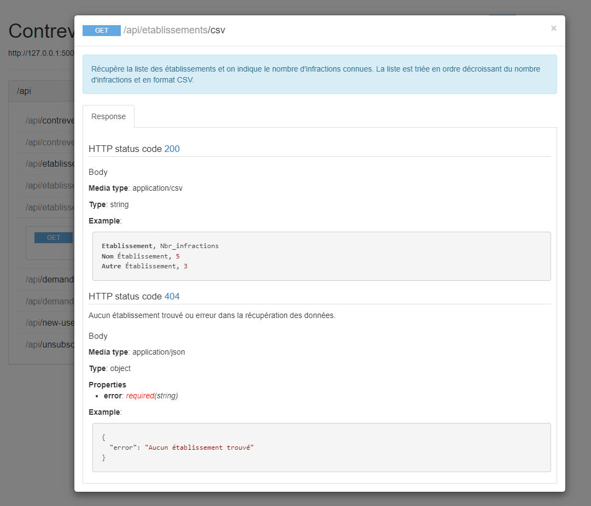

###### Utilisation de YARC

Après l'installation, vous pouvez commencer à utiliser YARC pour envoyer des
requêtes à une API :

1. **Lancer YARC** : Cliquez sur l'icône de YARC dans la barre d'outils de
   Chrome (
   en haut à droite, à côté de la barre d'adresse). Si l'icône n'apparaît pas
   directement, vous pourriez devoir cliquer sur l'icône du puzzle pour voir
   toutes les extensions et épingler YARC à la barre d'outils.
2. **Configurer la requête** :
    1. **URL** : Entrez l'URL de l'API
       'http://127.0.0.1:5000/api/etablissements/csv'
       dans le champ URL.
    2. **Méthode** : Sélectionnez la méthode HTTP 'POST' à partir du menu
       déroulant à côté de l'URL.
3. **Envoyer la requête** : Cliquez
   sur le bouton 'Send Request' pour l'envoyer. Les résultats de la requête
   apparaîtront
   dans la section Response en bas de l'interface de YARC.
   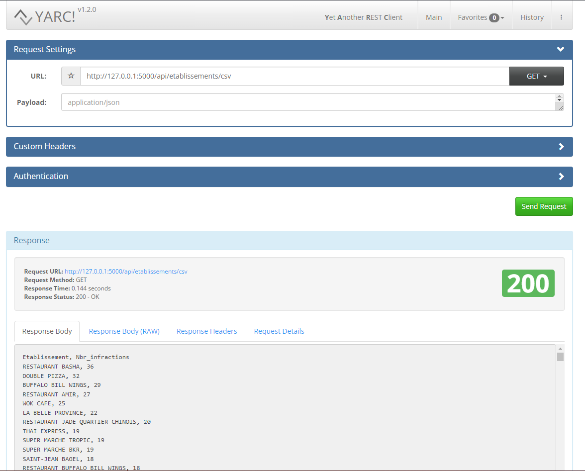

### E1 15xp /api/new-user - M.D.

#### Comment tester :

###### Documentation avec RAML

1. Lancez l'application avec la commande suivante dans votre terminal : `$
   make`
3. Ouvrez votre navigateur et accédez à http://127.0.0.1:5000/doc pour
   accéder à la documentation RAML.
4. Sélectionner la route '/api/new-user'
   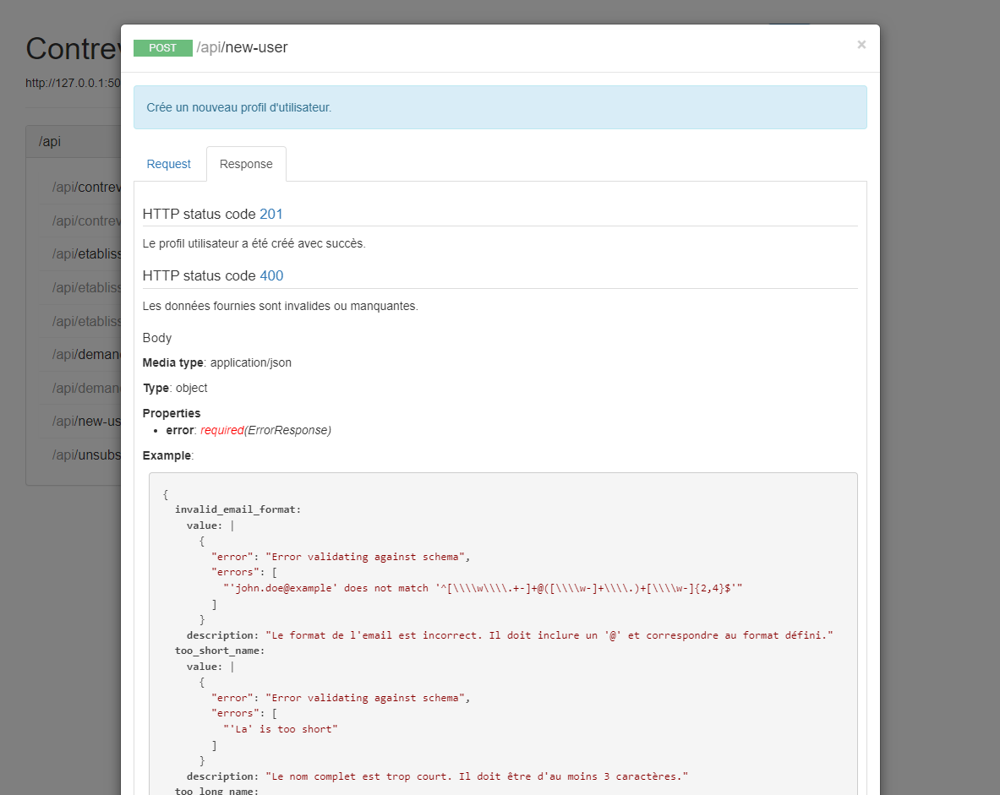

###### Utilisation de YARC

Après l'installation, vous pouvez commencer à utiliser YARC pour envoyer des
requêtes à une API :

1. **Lancer YARC** : Cliquez sur l'icône de YARC dans la barre d'outils de
   Chrome (
   en haut à droite, à côté de la barre d'adresse). Si l'icône n'apparaît pas
   directement, vous pourriez devoir cliquer sur l'icône du puzzle pour voir
   toutes les extensions et épingler YARC à la barre d'outils.
2. **Configurer la requête** :
    1. **URL** : Entrez l'URL de l'API
       'http://127.0.0.1:5000/api/new-user'
       dans le champ URL.
    2. **Méthode** : Sélectionnez la méthode HTTP 'GET' à partir du menu
       déroulant à côté de l'URL.
    3. **Corps de la requête** :
       Entrez les données suivantes dans le champ de texte pour le corps de la
       requête :

            {"nom_complet": "John Doe",
            "courriel": "john.doe@example.com",
            "choix_etablissements": [120681, 10327],
            "mdp": "john123"}

3. **Envoyer la requête** : Cliquez
   sur le bouton 'Send Request' pour l'envoyer. Les résultats de la requête
   apparaîtront
   dans la section Response en bas de l'interface de YARC.
   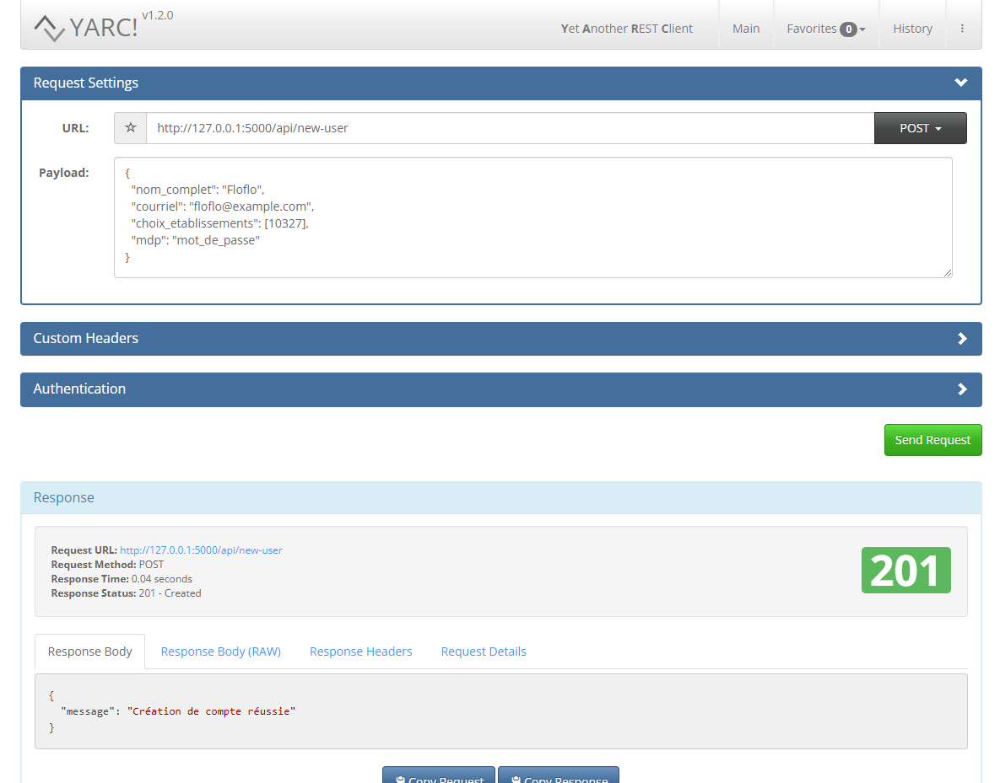

##### Création de compte à partir du site

1. Lancez l'application avec la commande suivante dans votre terminal : `$
   make`
2. Ouvrez votre navigateur et accédez à http://127.0.0.1:5000/ pour voir la
   page d'accueil.
2. Cliquer sur le bouton "Création de compte"
   
3. Compléter tous les champs et cliquer sur "Créer un compte"
   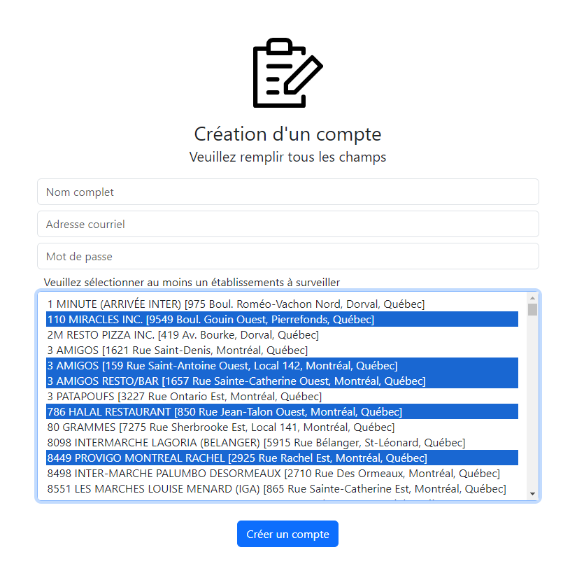
   

###### Vérification de la création de compte

1. Pour valider la création de votre compte, veuillez vous connecter en
   utilisant l'adresse courriel et le mot de passe que vous avez utilisés
   

### E2 15xp - M.D.

#### Comment tester :

###### Vérification de la création de compte

1. Lancez l'application avec la commande suivante dans votre terminal : `$
   make`
2. Ouvrez votre navigateur et accédez à http://127.0.0.1:5000/ pour voir la
   page d'accueil.
3. Cliquer sur "Se connecter" utiliser l'adresse courriel et le mot de
   passe que vous avez créés.
4. Cliquer sur l'onglet "Compte"
   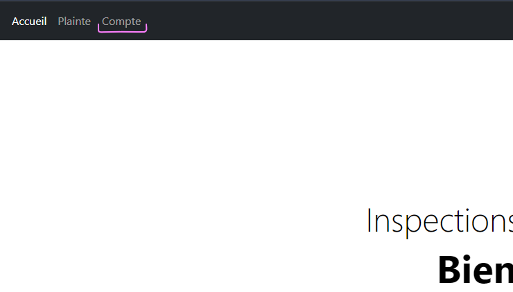

6. Sélectionner différents établissements à surveiller
7. Cliquer sur "Enregistrer les modifications"
8. Accéder à nouveau sur l'onglet "Compte" et les nouveaux choix afin de
   voir que l'enregistrement a fonctionné
9. Ajouter une photo et cliquer sur enregistrer
10. Accéder à nouveau sur l'onglet "Compte" et la photo y sera affichée

### E3 5xp - M.D.

#### Comment tester :

###### Utilisation MailDev

Installation de docker

1. Commencez par installer Docker sur votre ordinateur en suivant ce lien :
   https://www.docker.com/get-started/

###### Vérification de l'installation de Docker

2. Ouvrez un terminal et tapez la commande suivante pour vérifier si Docker
   est correctement installé : `docker --version`

###### Installation de MailDev

MailDev est un serveur SMTP de test qui intercepte tous les emails envoyés, les
affichant ensuite dans une interface web.

3. Pour installer MailDev, ouvrez votre terminal et exécutez les commandes
   suivantes :

   `$ docker pull maildev/maildev`

   `$ docker run -p 1080:1080 -p 1025:1025 maildev/maildev`
   
   Pour plus d'informations, veuillez lire la
   documentation : https://github.com/maildev/maildev/tree/master?tab=readme-ov-file

###### Démarrage de MailDev

4. Lancez Docker et démarrez le conteneur contenant l'image de MailDev.

###### Accéder à MailDev

5. Ouvrez un navigateur et allez sur : http://localhost:1080/ pour accéder à
   l'interface de MailDev.

##### Gestion des nouvelles dates d'importation

Pour tester le scénario d'envoi de notifications de nouvelles contraventions,
suivez ces étapes :

Il est nécessaire d'ajuster les dates d'importation de deux contraventions afin
de tester le scénario suivant : l'adresse email spécifiée sous "**monitoring**"
dans le fichier YAML doit recevoir une notification contenant les détails des
deux contraventions. Par ailleurs, l'utilisateur "**Manuel Roger**" doit
uniquement
recevoir une notification pour la contravention associée à *
*_id_business=116921_**,
étant donné que l'autre contravention ne figure pas parmi celles qu'il
surveille.

1. Ouvrez la console de gestion de votre base de données et accédez à la
   table des Contraventions.
2. Inscrivez les commandes suivantes **sans les exécuter** pour ajuster les
   dates
   d'importation :

`UPDATE Contravention SET date_importation = '2024-04-01 12:08:00:000' WHERE
id_poursuite = 6119;`

`UPDATE Contravention SET date_importation = '2024-04-01 12:08:00:000' WHERE
id_poursuite = 1523;`

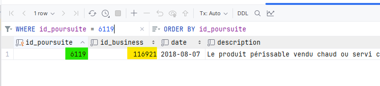
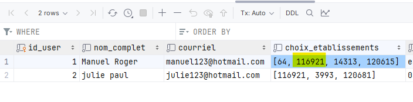

###### Mise à jour des dates :

1. Ajustez les dates d'importation en les
   configurant pour un **moment futur** (par exemple, **2 minutes après
   l'heure
   courante**).

2. Enregistrez les changements dans la base de données.

###### Mise à jour du CronTrigger :

1. Ouvrez le fichier 'main.py' et localisez la fonction 'start_scheduler()'.
   
2. Modifiez ensuite l'**heure du CronTrigger** pour qu'elle soit fixée après
   l'heure d'importation des deux contraventions. Dans ce cas précis,
   il faudrait la fixer à '2024-04-01 12:10:00:000', étant donné que
   l'heure d'importation est '2024-04-01 12:08:00:000'.

###### Lancement de l'application

1. Pour démarrer l'application et appliquer les modifications, utilisez la
   commande suivante dans votre terminal : `$ make`
2. Vérifiez les courriels reçus en accédant à l'onglet de navigation du
   **port 1080 de MailDev** pour confirmer la
   réception des notifications.

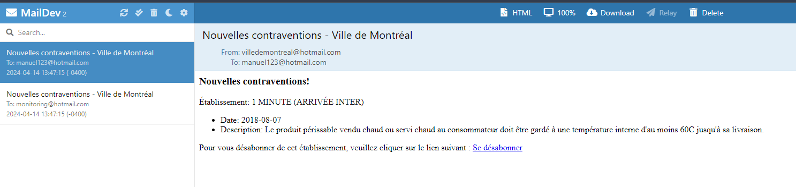


### E4 10xp - M.D.

#### Comment tester :

###### Documentation avec RAML

1. Lancez l'application avec la commande suivante dans votre terminal : `$
   make`
2. Ouvrez votre navigateur et accédez à http://127.0.0.1:5000/doc pour
   accéder à la documentation RAML.
3. Sélectionner la route '/api/unsubscribe'
   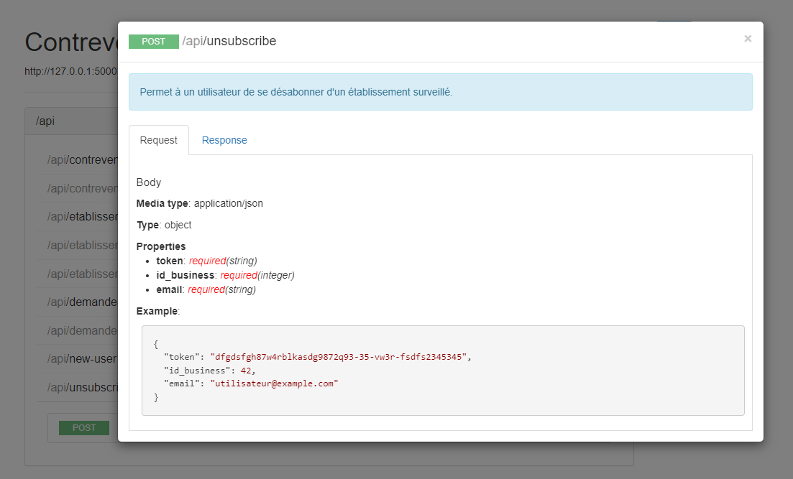

###### Utilisation de YARC

Après l'installation, vous pouvez commencer à utiliser YARC pour envoyer des
requêtes à une API :

1. **Lancer YARC** : Cliquez sur l'icône de YARC dans la barre d'outils de
   Chrome (
   en haut à droite, à côté de la barre d'adresse). Si l'icône n'apparaît pas
   directement, vous pourriez devoir cliquer sur l'icône du puzzle pour voir
   toutes les extensions et épingler YARC à la barre d'outils.
2. **Configurer la requête** :
    1. **URL** : Entrez l'URL de l'API
       'http://127.0.0.1:5000/api/unsubscribe'
       dans le champ URL.
    2. **Méthode** : Sélectionnez la méthode HTTP 'PATCH' à partir du menu
       déroulant à côté de l'URL.
    3. **Corps de la requête** :
       Entrez les données suivantes dans le champ de texte pour le corps de la
       requête :

            {"token": "d336d327-3f56-4a8b-a058-9ac9b2621896",
            "id_business": 116921,
            "email": "manuel123@hotmail.com"}
3. **Envoyer la requête** : Cliquez
   sur le bouton 'Send Request' pour l'envoyer. Les résultats de la requête
   apparaîtront
   dans la section Response en bas de l'interface de YARC.

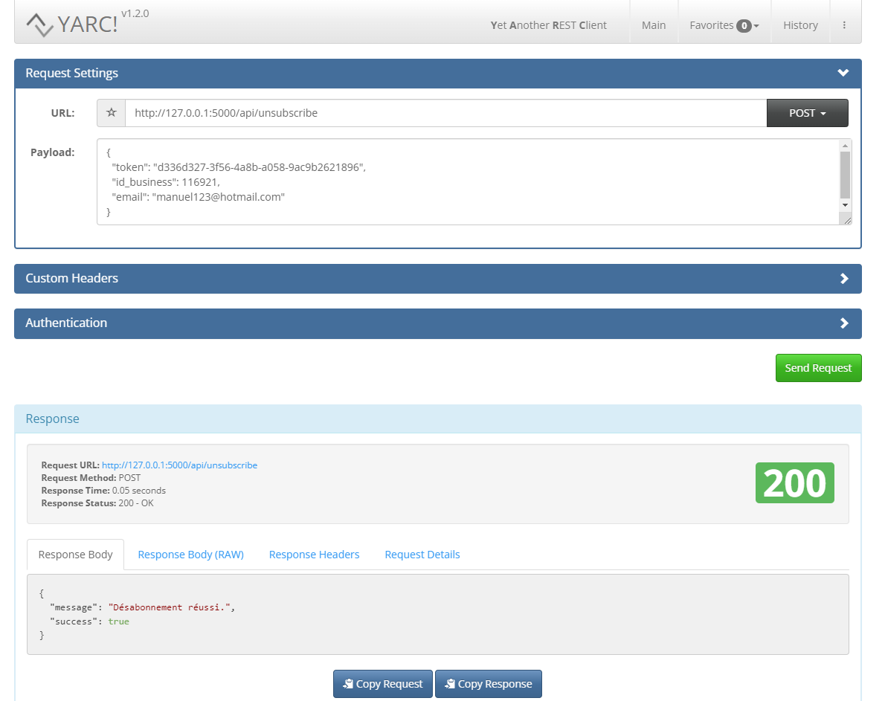

###### Désabonnement

1. Lancez l'application avec la commande suivante dans votre
   terminal : `$ make`
2. Veuillez répéter les étapes en E3
3. Veuillez cliquer sur le lien "Se désabonner" relié à l'établissement en
   question
4. Cliquer sur le bouton "Confirmer le désabonnement"
   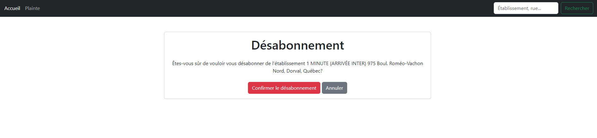
5. Voici la page de confirmation
   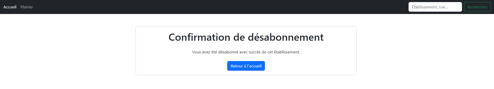

###### Vérification du désabonnement

Nous pouvons désormais nous connecter en tant que "**Manuel Roger**" pour
accéder à son compte et confirmer que le
désabonnement via un lien reçu par courriel a été effectué avec succès.

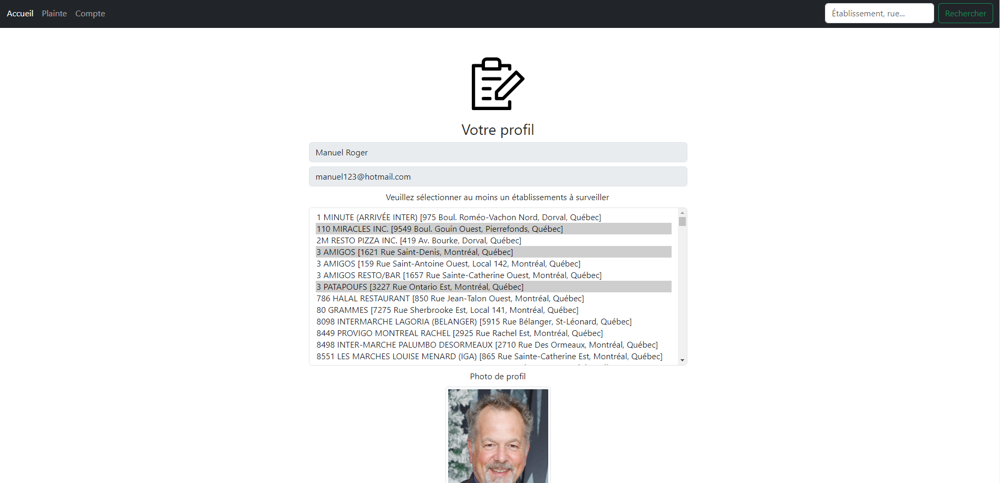

Si l'utilisateur clique de nouveau sur le lien du courriel, il sera redirigé
vers la page de désabonnement, où un
message s'affichera pour l'informer qu'il est déjà désabonné de cet
établissement.
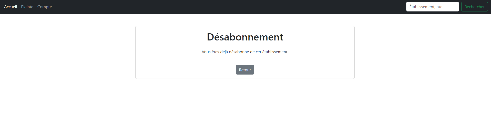

### F1 15xp - M.D.

#### Comment tester :

Voici le lien vers le site : https://projet-session.fly.dev/

### A2 10xp - A-S.A-L.

1. Lancez l'application avec la commande suivante dans votre terminal :

```sh
make
```

2. Ouvrez votre navigateur et accédez à http://127.0.0.1:5000/ pour voir la
   page d'accueil.

3. Cliquer sur la barre de recherche en haut à droite de la page
4. Effectuer une recherche par nom, établissement et/ou rue

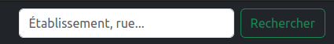

### A4 10xp - A-S.A-L.

Effectuez une requête `GET` à la
route `api/contrevenants?start-date<date1>&end-date=<date2>` via l'extension
YARC (ou tout autre REST client), en remplaçant `date1` et `date2` par les
dates que vous souhaitez testés.

Un exemple de requête valide :

```text
http://127.0.0.1:5000/api/contrevenants?start-date=2022-12-12&end-date=2024-12-12
```

### A5 10xp - A-S.A-L.

1. Aller sur la page d'accueil
2. Saisisser une date de début et une date de fin de recherche puis lancer une
   recherche
   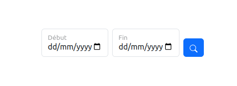
3. La liste des contrevenants ainsi que leur nombre de contraventions durant cette période s'affichera dans un tableau
   sous le formulaire.

### A6 10xp - A-S.A-L.

1. Aller sur la page d'accueil
2. Choisissez un établissement dans la liste déroulante
3. 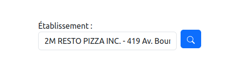
3. Cliquez sur l'icone de recherche
4. Un modal avec les différentes informations sur les infractions de l'établiassement va apparaitre.

### D1 15xp - A-S.A-L.

#### Tester le service REST

1- Effectuez une requête `POST` à la route `api/demande-inspection` via
l'extension YARC (ou tout autre REST client). Voici
un exemmple de `JSON` valide que vous pouvez utiliser pour les tests :

```json
{
  "etablissement": "Nom Établissement",
  "adresse": "123 avenue Chemin, Québec",
  "ville": "Montréal",
  "date_visite": "2022-11-05",
  "nom_complet_client": "Prenom Nom",
  "description": "Personnes affectées à la consommation de produits"
}
```

2- Vérifier que la demande ait bien été insérée dans la base de données en
effectuant les commandes suivantes (remplacer le id par celui envoyé dans la
réponse du serveur) :

```sh
sqlite3 demande_inspection.db
```

```sqlite3
SELECT * FROM DemandesInspection where id=1;
```

#### Tester la fonctionnalité

1. Cliquer sur l'onglet `Plainte` en haut à gauche de l'écran
   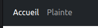
2. Remplissez et soumettez le formulaire
3. Effectuer les commandes ci-dessous et vérifier que votre demande ait bien été insérée dans la base de données:

```sh
sqlite3 demande_inspection.db
```

```sqlite3
SELECT * FROM DemandesInspection;
```

### D2 5xp - A-S.A-L.

1. Effectuez une requête `DELETE` à la route `api/demande-inspection/<id>` via
   l'extension YARC (ou tout autre REST client). Remplacer `<id>` par un des id présents dans la base de données. Pour
   trouver un id valide, faites les commandes suivantes :

```sh
sqlite3 demande_inspection.db
```

```sqlite3
SELECT * FROM DemandesInspection;
```

2. Une fois la requête envoyée, vérifier que la demande ait bien été supprimée dans la base de données avec la commande
   suivante (en remplaçant le id par celui utilisé dans la requête) :

```sqlite3
SELECT * FROM DemandesInspection where id=1;
```

### D3 15xp - A-S.A-L.

#### Tester les services REST

1. Dans YARC (ou tout autre REST client), entrez les `Credentials` suivants :

- Username = `user`
- Password = `mdp`

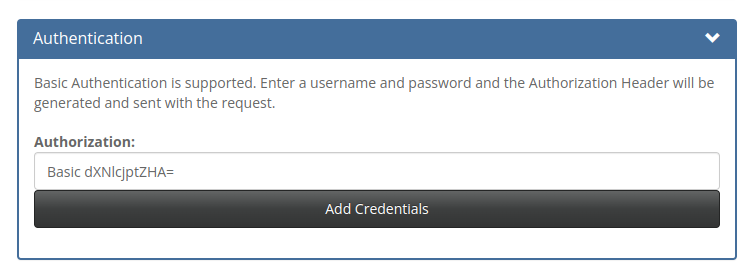

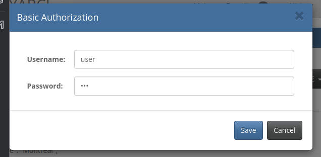

2. Effectuez une requête `PATCH` à la route `/api/contrevenant/{id_business}` via
   l'extension YARC (ou tout autre REST client). Remplacez le id par un `id_business` existant dans la base de donnée
   (exemple, 1). Voici
   un exemmple de `JSON` valide que vous pouvez utiliser pour ce test :

```json
{
  "ville": "Laval",
  "statut": "Fermé"
}
```

Vous pouvez essayer différentes variations de json, en incluant et excluant d'autres champs.

2. Effectuez une requête `DELETE` à la route `/api/contrevenant/{id_business}` via
   l'extension YARC (ou tout autre REST client). Remplacez le id par un `id_business` existant dans la base de données
   (exemple, 1).

#### Tester la fonctionnalité

1. Aller sur la page d'accueil
2. Saisisser une date de début et une date de fin de recherche puis lancer une
   recherche
   
3. La liste des contrevenants ainsi que leur nombre de contraventions durant cette période s'affichera dans un tableau
   sous le formulaire.
4. Cliquer sur un établissement
5. Tester la modification et la suppresion. Lorsque vous cliquerez sur l'icone de la suppression ou
   sur `Enregistrer les modifications`, vous devrez vous authentifié. Reprenez les mêmes informations utilisées
   précemment :

- Username = `user`
- Password = `mdp`

### D4 15xp - A-S.A-L.

Le `Basic Auth` a été appliqué aux services REST permettant la modification et la suppression de contrevenant au point
précédent.
Il vous est possible de retester l'authentification en allant modifier le nom d'utilisateur et le mot de passe utilisé
dans le
fichier `.env`. Pour ce faire, modidier les champs suivants :

```txt
SITE_USER="user"
SITE_PASS="mdp"
```

Redémarrer l'application et tester à nouveau la modification/suppression d'un contrevenant.
## B2 10xp A-S.A-L.

Le nom des établissements recevant de nouvelles contraventions sont publiées sur le compte Twitter suivant :
`https://twitter.com/Inspection61614`.

Deux façons de tester la fonctionnalité :

**Option 1**
Si vous avez testé la fonctionnalité `A3`, les contraventions ayant été mises à jour devraient
   se retrouver dans les `posts`.

**Option 2**
1. Sinon, ouvrez le fichier 'main.py' et localisez la fonction 'start_scheduler()'.
   
2. Ajustez l'**heure du CronTrigger** pour qu'elle soit réglée à **une minute
   après** l'heure d'importation des contraventions.
   Exemple:
   

3. Partez l'application (par exemple en effectuant la commande `make`.)
4. Dans le terminal `sqlite3`, effectuer un `Update` sur une date d'importation 
pour simuler une nouvelle importation. Ajustez la date d'importation en la
   configurant pour un **moment futur** (par exemple, **2 minutes après
   l'heure courante**). Par exemple :

```sh
sqlite3 contravention.db
```

```sqlite3
UPDATE Contravention SET date_importation = '2024-04-18 15:10:00:000' WHERE
id_poursuite = 6119;
```

4. Un post Twitter devrait apparaitre à lors de la prochaine mise à jour.

**NOTE**
Twitter n'accepte pas les posts identiques envoyés l'un après autre. 
Si vous recevez un code 409, essayez à nouveau la commande mais en changeant le `id_poursuite`. 