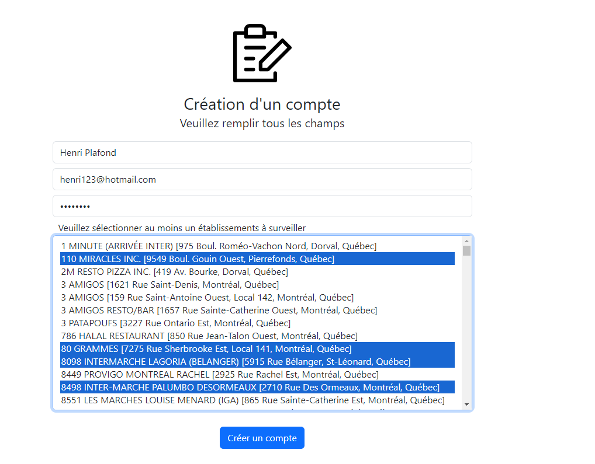
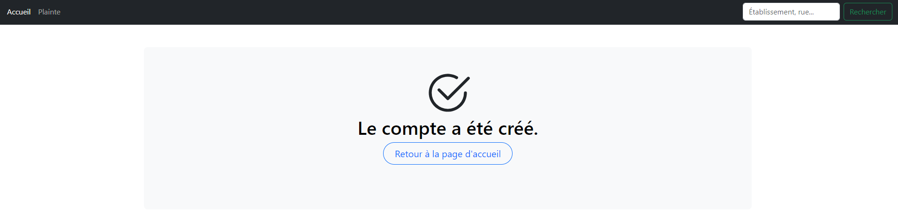
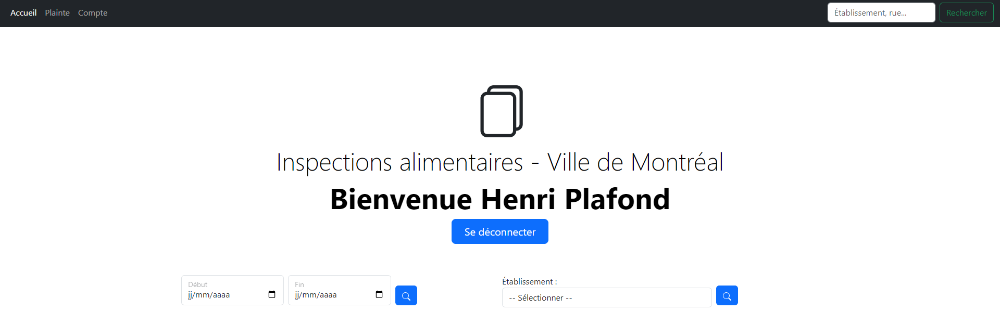
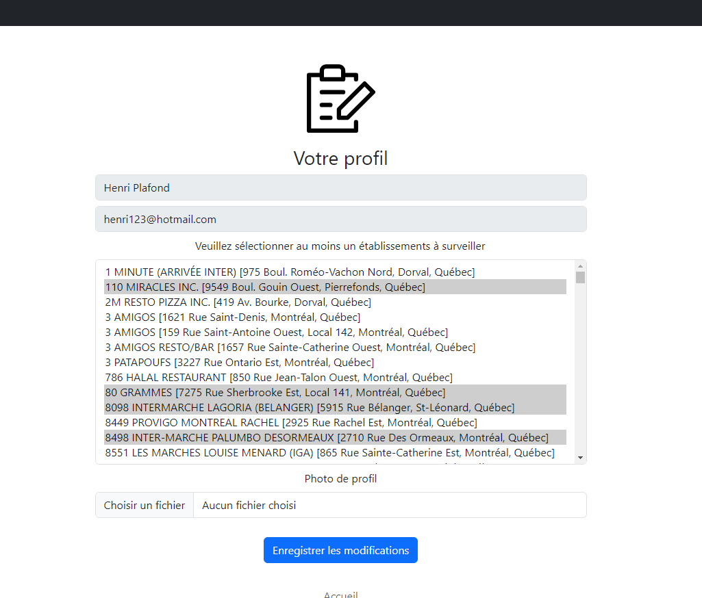
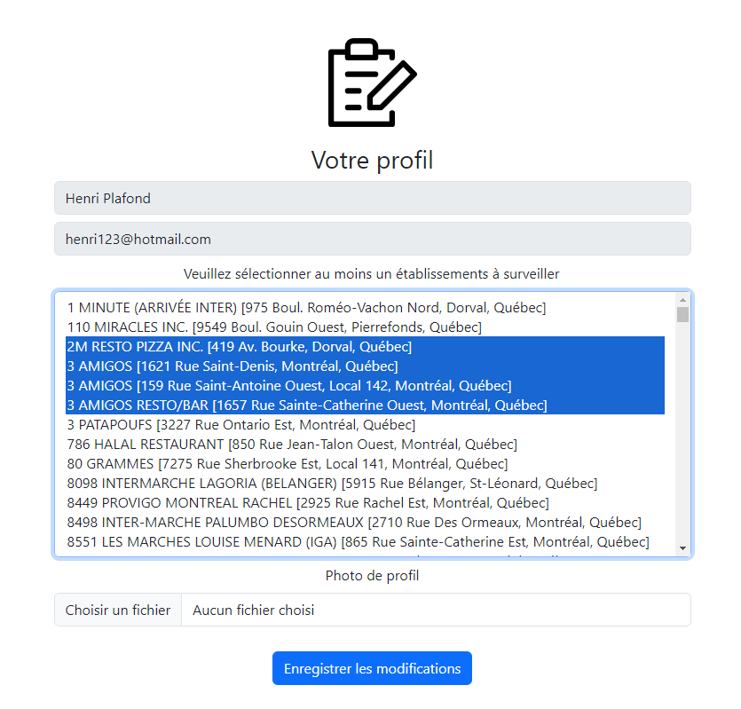
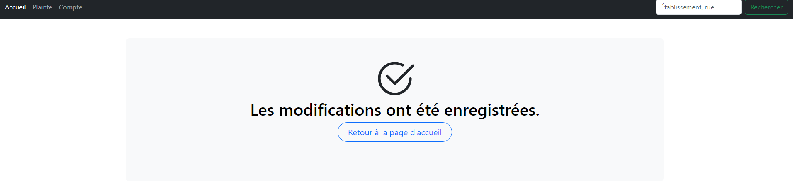
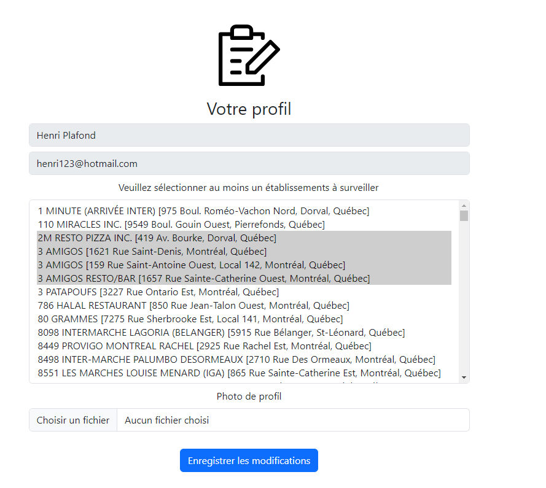
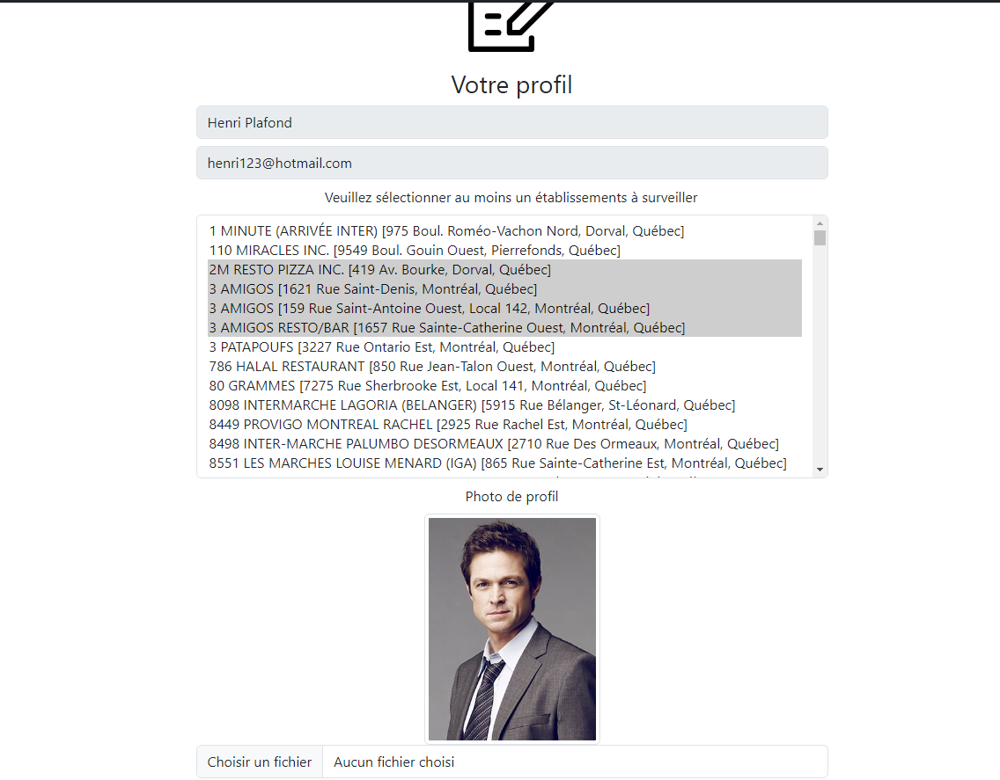

# Correction projet INF5190-H24 | ABEA05619105, DESM31559704

### Autrices:

* Anne-Sophie Abel-Levesque - ABEA05619105
* Milene Desjardins - DESM31559704

### A1 10xp - M.D.

#### Comment tester :

###### Importation des données avec la base de données "Contravention" déjà configurée.

1. Ouvrez le terminal dans le répertoire du projet.
2. Exécutez la commande suivante : `$ python3 download.py`

###### Création de la base de données "Contravention"

1. Lancez la création de la table en exécutant : `$ python3
   create_table_contravention.py`

### A3 5xp - M.D.

#### Comment tester :

Pour tester si le BackgroundScheduler fonctionne sans attendre à minuit, 
suivez ces étapes :

###### Gestion des nouvelles dates d'importation

1. Ouvrez la console de gestion de votre base de données et accédez à la
   table des Contraventions.
2. Inscrivez les commandes suivantes **sans les exécuter**, car il faut ajuster
   les dates d'importation :

`UPDATE Contravention SET date_importation = '2024-04-01 12:08:00:000' WHERE
id_poursuite = 6119;`

`UPDATE Contravention SET date_importation = '2024-04-01 12:08:00:000' WHERE
id_poursuite = 1523;`


###### Mise à jour des dates :

3. Ajustez les dates d'importation en les
   configurant pour un **moment futur** (par exemple, **une minute après
   l'heure
   courante**).

4. Enregistrez les changements dans la base de données.

###### Mise à jour du CronTrigger :

5. Ouvrez le fichier 'main.py' et localisez la fonction 'start_scheduler()'.
   
6. Ajustez l'**heure du CronTrigger** pour qu'elle soit réglée à **une minute
   après** l'heure actuelle.
   Exemple:


### B1 5xp - M.D.

#### Comment tester :

###### Utilisation MailDev

Installation de docker

1. Commencez par installer Docker sur votre ordinateur en suivant ce lien :
   https://www.docker.com/get-started/

###### Vérification de l'installation de Docker

2. Ouvrez un terminal et tapez la commande suivante pour vérifier si Docker
   est correctement installé : `docker --version`

###### Installation de MailDev

MailDev est un serveur SMTP de test qui intercepte tous les emails envoyés, les
affichant ensuite dans une interface web.

3. Pour installer MailDev, ouvrez votre terminal et exécutez les commandes
   suivantes :

   `$ docker pull maildev/maildev`

   `$ docker run -p 1080:1080 -p 1025:1025 maildev/maildev`
   
   Pour plus d'informations, veuillez lire la
   documentation : https://github.com/maildev/maildev/tree/master?tab=readme-ov-file

###### Démarrage de MailDev

6. Lancez Docker et démarrez le conteneur contenant l'image de MailDev.

###### Accéder à MailDev

7. Ouvrez un navigateur et allez sur : http://localhost:1080/ pour accéder à
   l'interface de MailDev.

##### Gestion des nouvelles dates d'importation

Pour tester le scénario d'envoi de notifications de nouvelles contraventions,
suivez ces étapes :

Il est nécessaire d'ajuster les dates d'importation de deux contraventions afin
de tester le scénario suivant : l'adresse email spécifiée sous "**monitoring**"
dans le fichier YAML doit recevoir une notification contenant les détails des
deux contraventions.

1. Ouvrez la console de gestion de votre base de données et accédez à la
   table des Contraventions.
2. Inscrivez les commandes suivantes **sans les exécuter**,car il faut ajuster
   les dates d'importation :

`UPDATE Contravention SET date_importation = '2024-04-01 12:08:00:000' WHERE
id_poursuite = 6119;`

`UPDATE Contravention SET date_importation = '2024-04-01 12:08:00:000' WHERE
id_poursuite = 1523;`


###### Mise à jour des dates :

3. Ajustez les dates d'importation en les
   configurant pour un **moment futur** (par exemple, **une minute après
   l'heure
   courante**).

4. Enregistrez les changements dans la base de données.

###### Mise à jour du CronTrigger :

5. Ouvrez le fichier 'main.py' et localisez la fonction 'start_scheduler()'.
   
6. Modifiez ensuite l'**heure du CronTrigger** pour qu'elle soit fixée après
   l'heure d'importation des deux contraventions. Dans ce cas précis,
   il faudrait la fixer à '_2024-04-01 12:10:00:000_', étant donné que
   l'heure d'importation est '_2024-04-01 12:08:00:000_'.

###### Lancement de l'application

5. Pour démarrer l'application et appliquer les modifications, utilisez la
   commande suivante dans votre terminal : `$ make`

6. Vérifiez les courriels reçus en accédant à l'onglet de navigation du **port
   1080 de MailDev** pour confirmer la
   réception des notifications.


### C1 10xp - M.D.

#### Comment tester reblabla

### C2 5xp - M.D.

#### Comment tester reblabla

### C3 5xp - M.D.

#### Comment tester reblabla

### E1 15xp - M.D.

#### Comment tester :

1. Lancez l'application avec la commande suivante dans votre terminal : `$
   make`
2. Ouvrez votre navigateur et accédez à http://127.0.0.1:5000/ pour voir la
   page d'accueil.
2. Cliquer sur le bouton "Création de compte"
3. Compléter tous les champs et cliquer sur "Créer un compte"
   
   

### E2 15xp - M.D.

#### Comment tester :

###### Vérification de la création de compte

1. Lancez l'application avec la commande suivante dans votre terminal : `$
   make`
2. Ouvrez votre navigateur et accédez à http://127.0.0.1:5000/ pour voir la
   page d'accueil.
3. Cliquer sur "Se connecter" utiliser l'adresse courriel "henri123@hotmail.
   com" et le mot de passe "henri123".
   
4. Cliquer sur l'onglet "Compte"
   
5. Voici à quoi ressemble le compte présentement :
   
6. Nous allons sélectionner différents établissements à surveiller :
   
7. Cliquer sur "Enregistrer les modifications"
   
8. Accéder à nouveau sur l'onglet "Compte" et les nouveaux choix se sont
   bien enregistrés :
   
9. Ajouter une photo et cliquer sur enregistrez
10. Accéder à nouveau sur l'onglet "Compte" et la photo s'est bien
    enregistrée :
    

### E3 5xp - M.D.

#### Comment tester :

###### Utilisation MailDev

Installation de docker

1. Commencez par installer Docker sur votre ordinateur en suivant ce lien :
   https://www.docker.com/get-started/

###### Vérification de l'installation de Docker

2. Ouvrez un terminal et tapez la commande suivante pour vérifier si Docker
   est correctement installé : `docker --version`

###### Installation de MailDev

MailDev est un serveur SMTP de test qui intercepte tous les emails envoyés, les
affichant ensuite dans une interface web.

3. Pour installer MailDev, ouvrez votre terminal et exécutez les commandes
   suivantes :

   `$ docker pull maildev/maildev`

   `$ docker run -p 1080:1080 -p 1025:1025 maildev/maildev`
   
   Pour plus d'informations, veuillez lire la
   documentation : https://github.com/maildev/maildev/tree/master?tab=readme-ov-file

###### Démarrage de MailDev

6. Lancez Docker et démarrez le conteneur contenant l'image de MailDev.

###### Accéder à MailDev

7. Ouvrez un navigateur et allez sur : http://localhost:1080/ pour accéder à
   l'interface de MailDev.

##### Gestion des nouvelles dates d'importation

Pour tester le scénario d'envoi de notifications de nouvelles contraventions,
suivez ces étapes :

Il est nécessaire d'ajuster les dates d'importation de deux contraventions afin
de tester le scénario suivant : l'adresse email spécifiée sous "**monitoring**"
dans le fichier YAML doit recevoir une notification contenant les détails des
deux contraventions. Par ailleurs, l'utilisateur "**Manuel Roger**" doit
uniquement
recevoir une notification pour la contravention associée à *
*_id_business=116921_**,
étant donné que l'autre contravention ne figure pas parmi celles qu'il
surveille.

1. Ouvrez la console de gestion de votre base de données et accédez à la
   table des Contraventions.
2. Inscrivez les commandes suivantes **sans les exécuter** pour ajuster les
   dates
   d'importation :

`UPDATE Contravention SET date_importation = '2024-04-01 12:08:00:000' WHERE
id_poursuite = 6119;`

`UPDATE Contravention SET date_importation = '2024-04-01 12:08:00:000' WHERE
id_poursuite = 1523;`


###### Mise à jour des dates :

3. Ajustez les dates d'importation en les
   configurant pour un **moment futur** (par exemple, **une minute après
   l'heure
   courante**).

4. Enregistrez les changements dans la base de données.

###### Mise à jour du CronTrigger :

5. Ouvrez le fichier 'main.py' et localisez la fonction 'start_scheduler()'.
   
6. Modifiez ensuite l'**heure du CronTrigger** pour qu'elle soit fixée après
   l'heure d'importation des deux contraventions. Dans ce cas précis,
   il faudrait la fixer à '2024-04-01 12:10:00:000', étant donné que
   l'heure d'importation est '2024-04-01 12:08:00:000'.

###### Lancement de l'application

7. Pour démarrer l'application et appliquer les modifications, utilisez la
   commande suivante dans votre terminal : `$ make`

8. Vérifiez les courriels reçus en accédant à l'onglet de navigation du
   **port 1080 de MailDev** pour confirmer la
   réception des notifications.


### E4 10xp - M.D.

#### Comment tester :

###### Désabonnement

1. Lancez l'application avec la commande suivante dans votre
   terminal : `$ make`
2. Veuillez répéter les étapes en E3
3. Veuillez cliquer sur le lien "Se désabonner" relié à l'établissement en
   question
4. Cliquer sur le bouton "Confirmer le désabonnement"
   
5. Voici la page de confirmation
   

###### Vérification du désabonnement

Nous pouvons désormais nous connecter en tant que "**Manuel Roger**" pour
accéder à son compte et confirmer que le
désabonnement via un lien reçu par courriel a été effectué avec succès.


Si l'utilisateur clique de nouveau sur le lien du courriel, il sera redirigé
vers la page de désabonnement, où un
message s'affichera pour l'informer qu'il est déjà désabonné de cet
établissement.


### F1 15xp - M.D.

#### Comment tester :

Voici le lien vers le site : https://projet-session.fly.dev/

### A2 10xp - A-S.A-L.

1. Lancez l'application avec la commande suivante dans votre terminal : `$
   make`
2. Ouvrez votre navigateur et accédez à http://127.0.0.1:5000/ pour voir la
   page d'accueil.

3. Aller sur la page d'accueil (la barre de recherche est également accessible
   partout sur le site)
4. Cliquer sur la barre de recherche en haut à droite de la page
5. Effectuer une recherche
    - Par nom et/ou établissement et/ou rue
    - vide (envoyer une requête vide)

### A4 10xp - A-S.A-L.

Effectuez une requête `GET` à la
route `api/contrevenants?start-date<date1>&end-date=<date2>` via l'extension
YARC (ou tout autre REST client), en remplaçant `date1` et `date2` par les
dates que vous souhaitez testés.

Un exemple de requête valide :

```text
api/contrevenants?start-date=2022-12-12&end-date=2024-12-12
```

### A5 10xp - A-S.A-L.

1. Aller sur la page d'accueil
2. Saisisser une date de début et une date de fin de recherche puis lancer une
   recherche


### A6 10xp - A-S.A-L.

1. Aller sur la page d'accueil
2. Saisisser une date de début et une date de fin de recherche puis lancer une
   recherche


### D1 15xp - A-S.A-L.

#### Tester le service REST

1- Effectuez une requête `POST` à la route `api/demande-inspection` via
l'extension YARC (ou tout autre REST client). Voici
un exemmple de `JSON` valide que vous pouvez utiliser pour les tests :

```json
{
  "etablissement": "Nom Établissement",
  "adresse": "123 avenue Chemin, Québec",
  "ville": "Montréal",
  "date_visite": "2022-11-05",
  "nom_complet_client": "Prenom Nom",
  "description": "Personnes affectées à la consommation de produits"
}
```

2- Vérifier que la demande ait bien été insérée dans la base de données en
effectuant les commandes suivantes (remplacer le id par celui envoyé dans la
réponse du serveur)

```sh
sqlite3 demande_inspection.db
```

```sqlite3
SELECT * FROM DemandesInspection where id=1;
```

#### Tester la fonctionnalité

**TODO count ???**

1- Cliquer sur l'onglet `Plainte` en haut à gauche de l'écran
2- Remplissez et soumettez le formulaire
3-

### D2 5xp - A-S.A-L.

1- Effectuez une requête `POST` à la route `api/demande-inspection` via
l'extension YARC (ou tout autre REST client). Voici
un exemmple de `JSON` valide que vous pouvez utiliser pour les tests :

#### Comment tester reblabla

### D3 15xp - A-S.A-L.

#### Comment tester reblabla

### D4 15xp - A-S.A-L.

#### Comment tester reblabla

Mettre user et mdp dans fichier .quelquechose

## B2 10xp A-S.A-L.

TODO enlever photo

@Inspection61614
